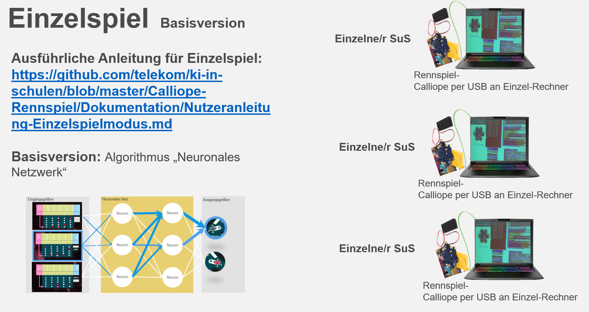

# Nutzeranleitung Einzelspielmodus (Basisversion)

Voraussetzung ist eine erfolgreich durchgeführte und getestete Basisinstallation unserers Projektes anhand der Installationsanleitungen:
* [Windows](./INSTALL-Win.md)
* [Linux](./INSTALL-Lin.md)
* [MacOS](./INSTALL-Mac.md)

Der "__Einzelspielmodus__" ist für Oberstufe empfohlen, und kann optional mit der Expertenvariante (Orange) erweitert werden. Dies hier ist die Anleitung für die Basisversion.

Die Nutzeranleitung für die Expertenvariante ist hier zu finden:
* [Nutzeranleitung Einzelspielmodus - Expertenversion mit Orange](./Nutzeranleitung-Einzelspielmodus-Orange.md)

Im "Einzelspielmodus" kann __jeder Schüler seine eigene künstliche Intelligenz__ trainieren. Dafür benötigt jeder Schüler mindestens eine Basisinstallation auf seinem Schülerrechner, optional die Expertenvariante mit Orange.

### Durchführung "Einzelspielmodus"

#### Einleitung

Pro Schüler wird 1 "Rennspiel-Calliope" benötigt, der direkt per USB an den Rechner des Schülers angeschlossen wird.

#### Schritt 1 - Rennspiel installieren

Diesen Schritt muss jeder Schüler durchführen.

Hierzu muss ein Calliope Mini per USB an den Schülerrechner angeschlossen werden.

*MakeCode-Variante*

* Die Datei `/ki-in-schulen-master/Calliope-Rennspiel/Makecode/rennspiel-funkgruppe1-makecode.hex` auf den per USB angeschlossenen Calliope Mini kopieren. (Die Funkgruppe ist im Einzelspielmodus egal, da die Datensammlung über USB funktioniert)

*OpenRoberta-Variante*

* Die Datei `/ki-in-schulen-master/Calliope-Rennspiel/OpenRoberta/rennspiel-openroberta.hex` auf den per USB angeschlossenen Calliope Mini kopieren. (Die Funkgruppe __muss__ beim Start auf __0__ gewählt bleiben, damit das USB-Logging aktiv ist)

#### Schritt 2 - COM-Port des per USB angeschlossenen "Rennspiel-Calliopes" herausfinden

* Windows: via Gerätemanager, wird als "USB Serial Device" angezeigt

* Linux: `ls -al /dev/ttyACM*`

  ggf. Nutzer zur `dialout` Nutzergruppe hinzufügen, damit dieser auf den Calliope Mini auch zugreifen darf.

  `sudo usermod -aG <username> dialout`

  `sudo adduser <username> dialout`

#### Schritt 3 - Datensammel-Phase

* Auf jedem Schülerrechner ausführen: `python ki-datenlogger.py <COM-Port>` (COM-Port in Schritt 2 herausgefunden)

* __Startschuss__ für das Rennspiel auf dem "Rennspiel"-Calliope jedes Schülers (Calliope muss per USB am Schülerrechner angeschlossen bleiben). Die Schüler spielen das Rennspiel, so lange vorgegeben; dabei werden die Rohdaten per USB an den Schülerrechner übertragen. Am Ende ist eine beliebige Taste am Schülerrechner zu drücken, um das Datensammeln zu beenden und die Rohdaten in eine Datei zu speichern.

* Im Unterverzeichnis `csv-rohdaten` werden die Rohdaten abgelegt unter dem angezeigten Dateinamen, bspw. `ki-rennspiel-log-20210303111213.csv`

#### Schritt 4 - Trainingsphase (KI anlernen)

* Auf jedem Schülerrechner ausführen: `python ki-trainieren-sklearn.py <CSV-Datei>` (CSV-Datei in Schritt 3 gespeichert)

* Im Unterverzeichnis `modelle` wird ein trainiertes neuronales Netzwerk abgelegt unter dem angezeigten Dateinamen, bspw. `sklearn-py-modell-20210302220807.pkcls` und `sklearn-py-modell-20210302220807.json`

#### Schritt 5 - Testphase (KI die Steuerung übernehmen lassen)

*Variante A: IQ-Test auf Schülergruppenrechner*

* Auf jedem Schülergruppenrechner ausführen: `python ki-rennspiel.py sklearn <PKCLS-Datei>` (PKCLS-Datei in Schritt 5 gespeichert)

* Um zu sehen, wie gut oder schlecht die angelernte KI steuert:

  * Turbo ausgeschaltet lassen (Standard)
  * KI spielen lassen durch Drücken von Taste __2__

* Da es sich um ein zufallsgesteuertes Rennspiel handelt, wird für eine Auswertung der KI-Leistung das Rennspiel 50-mal durch die KI gespielt und dann der Medianwert der erreichten Punktzahl angezeigt:

  * Turbo anschalten durch Drücken Taste __T__
  * KI spielen lassen durch Drücken von Taste __2__
  * 50 Episoden werden durch die KI gespielt
  * Medianwert der erreichten Punktzahl wird angezeigt.

*Variante B: IQ-Test auf Calliope Mini*

Das trainierte neuronale Netzwerk kann auch direkt auf dem Calliope Mini getestet werden.

Projektziel ist es, die "Hirntransplantation" des trainierten KI-Modells für die SuS über die Oberfläche auf https://makecode.calliope.cc nachvollziehbar zu machen; Stand März 2021 verhinderte jedoch ein Bug in Makecode diese Variante.

Daher wurde im Projekt ein temporärer Behelfsmechanismus implementiert:

* Auf dem Schülergruppenrechner ins Verzeichnis wechseln: `ki-in-schulen-master/Calliope-Rennspiel/Python/iq-test-calliope/`
* Auf dem Schülergruppenrechner ausführen: `python iq-test-erstellen.py -r <JSON-Modelldatei>` (Die JSON-Modelldatei ist eine in Schritt 4 erzeugte Modelldatei, bspw. `sklearn-py-modell-20210302220807.json`)
* Die erzeugte Calliope Hex-Datei `iq-test-calliope.hex` kann auf einen Calliope Mini kopiert werden
* Die trainierte KI übernimmt die Steuerung im Rennspiel (manuelle Steuerung ist zusätzlich möglich)
